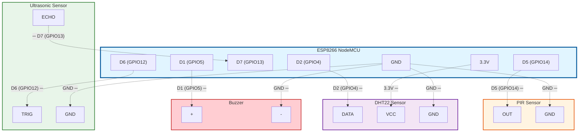

# ESP8266 NodeMCU Circuit Connections

Mermaid diagram showing the exact pin connections for the ESP8266 NodeMCU sensor node.

## Connection List

Based on your specifications:

- **D5 (GPIO14)** ─ PIR OUT
- **D6 (GPIO12)** ─ Ultrasonic TRIG
- **D7 (GPIO13)** ─ Ultrasonic ECHO
- **D2 (GPIO4)** ─ DHT22 DATA
- **D1 (GPIO5)** ─ Buzzer +
- **3.3V** ─ DHT22 VCC
- **GND** ─ Common Ground (all components)

## Connection Table

| ESP8266 Pin | Component Pin | Description |
|-------------|---------------|-------------|
| D5 (GPIO14) | PIR OUT | Digital Input - Motion Detection |
| D6 (GPIO12) | Ultrasonic TRIG | Digital Output - Trigger Pulse |
| D7 (GPIO13) | Ultrasonic ECHO | Digital Input - Echo Pulse |
| D2 (GPIO4) | DHT22 DATA | Digital I/O - Data Communication |
| D1 (GPIO5) | Buzzer + | Digital Output - Buzzer Control |
| 3.3V | DHT22 VCC | Power Supply |
| GND | All GND Pins | Common Ground |

