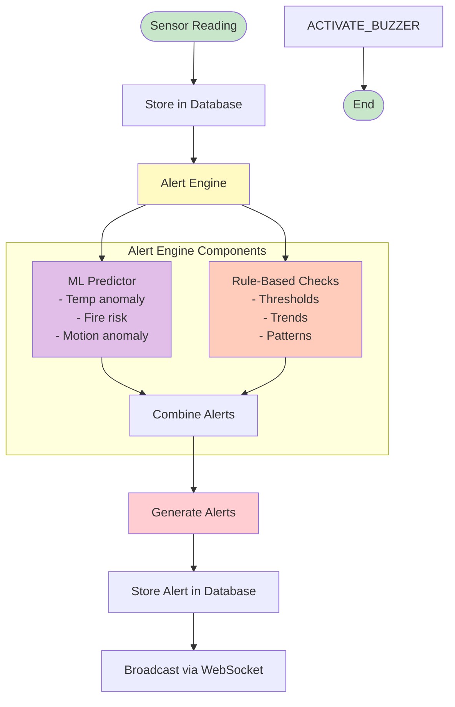
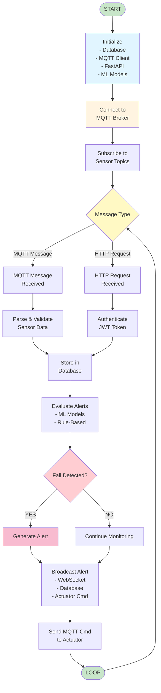
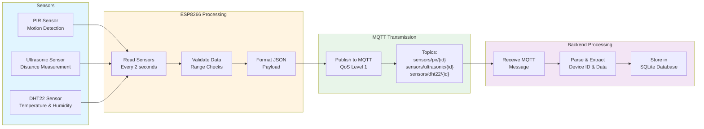
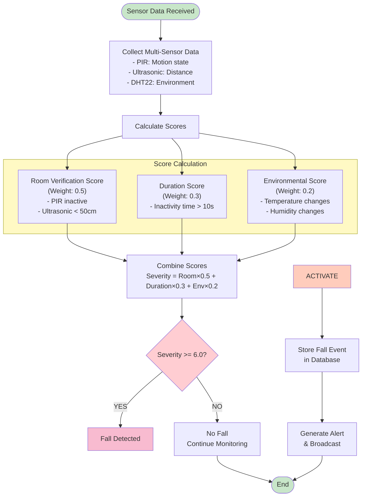
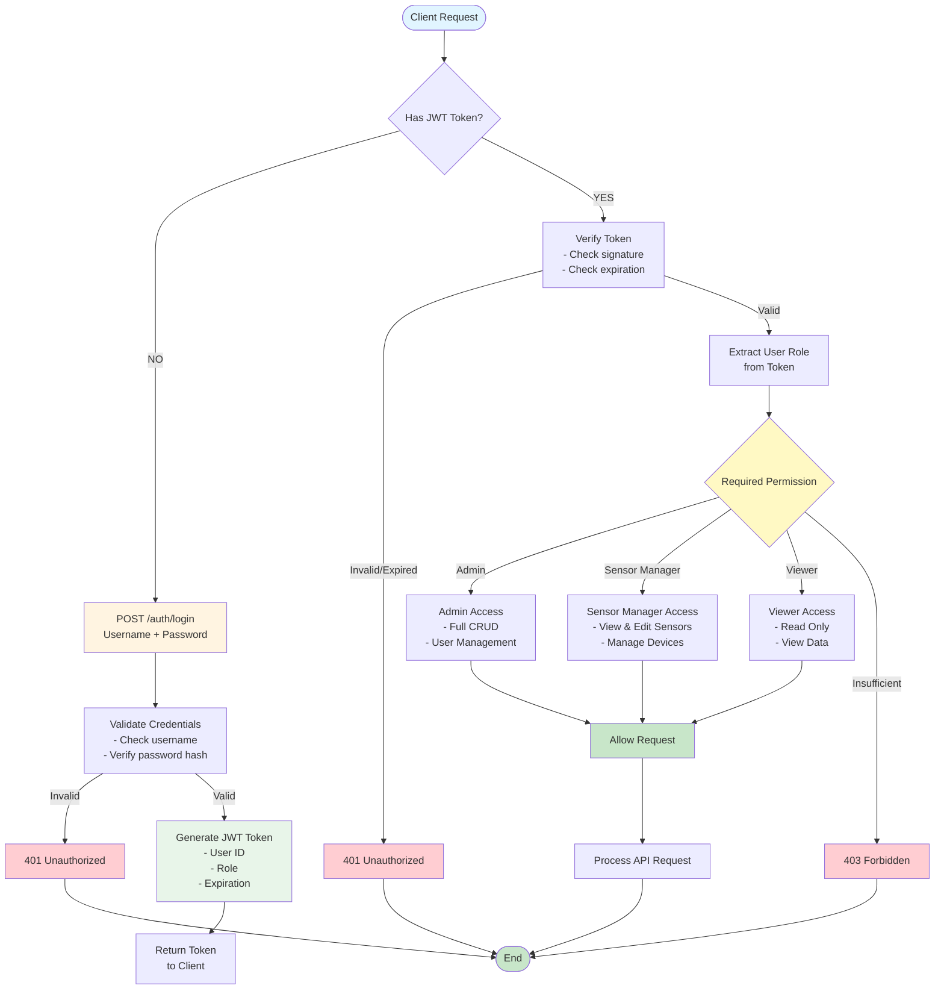
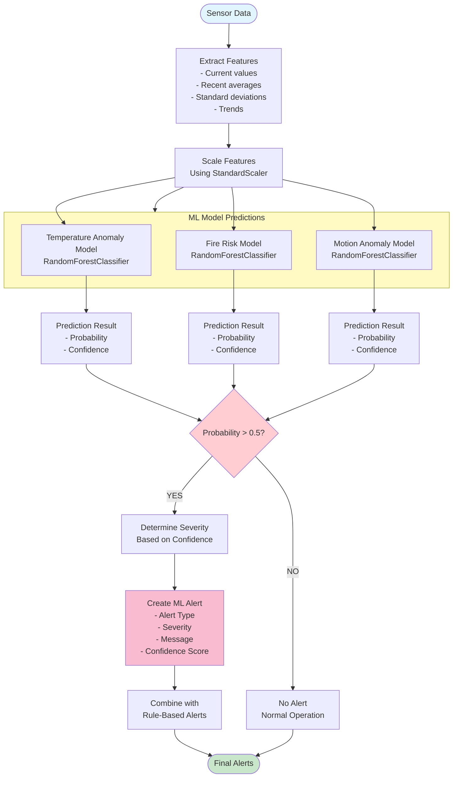
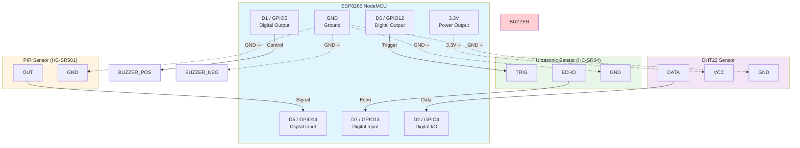
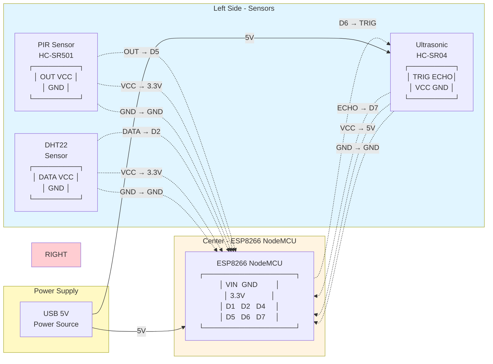
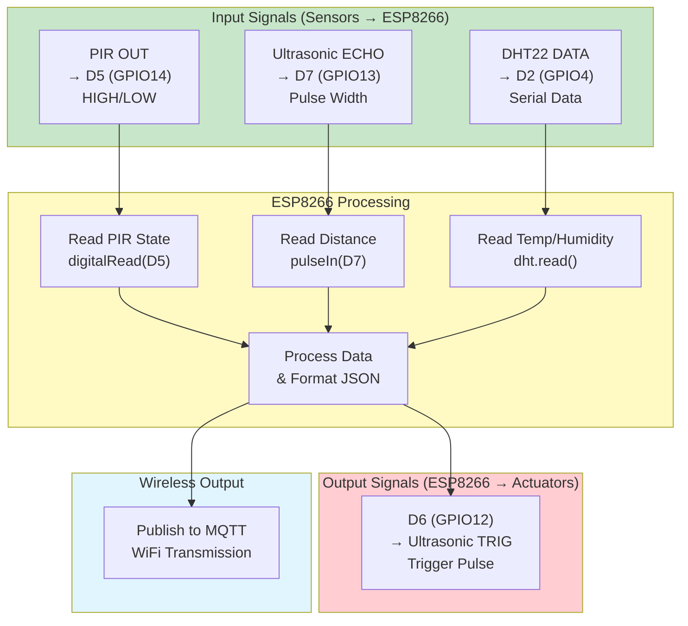

# Mermaid Flowcharts for AI-Driven Fall Detection System

This document contains all Mermaid flowchart code for the coursework report. You can use these in Markdown files, documentation tools, or online Mermaid editors.

---

## 1. System-Level Data Flow Diagram

This diagram shows the complete data flow from sensors to user interfaces.

```mermaid
flowchart TD
    subgraph ESP8266["ESP8266 SENSOR NODES"]
        PIR["PIR Sensor"]
        ULTRASONIC["Ultrasonic Sensor"]
        DHT22["DHT22 Sensor"]
        ESP8266_NODE["ESP8266 NodeMCU<br/>(Sensor Data Processing)"]
        
        PIR --> ESP8266_NODE
        ULTRASONIC --> ESP8266_NODE
        DHT22 --> ESP8266_NODE
    end
    
    ESP8266_NODE -->|WiFi + MQTT<br/>(Encrypted)| MQTT_BROKER["MQTT BROKER (Mosquitto)<br/>Raspberry Pi (Port 1883)<br/><br/>Topics:<br/>- sensors/pir/{device_id}<br/>- sensors/ultrasonic/{device_id}<br/>- sensors/dht22/{device_id}"]
    
    MQTT_BROKER -->|MQTT Subscribe| BACKEND["FASTAPI BACKEND<br/>(Raspberry Pi)"]
    
    subgraph BACKEND_COMPONENTS["Backend Components"]
        MQTT_HANDLER["MQTT Message Handler<br/>- Parse sensor data<br/>- Validate payload"]
        ALERT_ENGINE["Alert Engine<br/>- Rule-based evaluation<br/>- ML model inference<br/>- Fall detection algorithm"]
        DATABASE["Database Layer (SQLite)<br/>- sensor_readings table<br/>- alerts table<br/>- fall_events table"]
        WEBSOCKET["WebSocket Server<br/>- Real-time alert broadcasting<br/>- Live sensor data updates"]
        
        MQTT_HANDLER --> ALERT_ENGINE
        ALERT_ENGINE --> DATABASE
        DATABASE --> WEBSOCKET
    end
    
    BACKEND --> MQTT_HANDLER
    
    WEBSOCKET -->|HTTP/WebSocket<br/>(JWT Authenticated)| USER_INTERFACES["USER INTERFACES"]
    
    subgraph USER_INTERFACES_COMPONENTS["User Interface Components"]
        WEB_DASHBOARD["Web Dashboard (React)<br/>- Real-time visualization<br/>- Alert management"]
        MOBILE_APP["Mobile App (Flutter)<br/>- Notifications<br/>- Alerts<br/>- Monitoring"]
    end
    
    USER_INTERFACES --> WEB_DASHBOARD
    USER_INTERFACES --> MOBILE_APP
    
    style ESP8266 fill:#e1f5ff
    style MQTT_BROKER fill:#fff4e1
    style BACKEND fill:#e8f5e9
    style USER_INTERFACES fill:#f3e5f5
```

---

## 2. Alert Generation Flow Diagram

This diagram shows the process of generating alerts from sensor readings.



---

## 3. Central Unit (Raspberry Pi) Flowchart

This diagram shows the main processing loop of the central unit.



---

## 4. Sensor Data Processing Flow

This diagram shows how sensor data is processed from reading to storage.



---

## 5. Fall Detection Algorithm Flow

This diagram shows the multi-sensor fall detection algorithm.



---

## 6. Authentication & Authorization Flow

This diagram shows the authentication and authorization process for API access.



---

## 7. ML Model Inference Flow

This diagram shows how ML models are used for alert prediction.



---

## 8. ESP8266 NodeMCU Pin Connection Diagram

This diagram shows the exact pin connections for the ESP8266 NodeMCU sensor node.



### Pin Connection List

Based on your specifications:

- **D5 (GPIO14)** ─ PIR OUT
- **D6 (GPIO12)** ─ Ultrasonic TRIG
- **D7 (GPIO13)** ─ Ultrasonic ECHO
- **D2 (GPIO4)** ─ DHT22 DATA
- **D1 (GPIO5)** ─ Buzzer +
- **3.3V** ─ DHT22 VCC
- **GND** ─ Common Ground (all components)

### Connection Details Table

| ESP8266 Pin | Component Pin | Description |
|-------------|---------------|-------------|
| D5 (GPIO14) | PIR OUT | Digital Input - Motion Detection |
| D6 (GPIO12) | Ultrasonic TRIG | Digital Output - Trigger Pulse |
| D7 (GPIO13) | Ultrasonic ECHO | Digital Input - Echo Pulse |
| D2 (GPIO4) | DHT22 DATA | Digital I/O - Data Communication |
| D1 (GPIO5) | Buzzer + | Digital Output - Buzzer Control |
| 3.3V | DHT22 VCC | Power Supply |
| GND | All GND Pins | Common Ground |

**Note:** 
- PIR sensor typically operates at 3.3V-5V (check your specific model)
- Ultrasonic sensor (HC-SR04) requires 5V for VCC, but ECHO pin is 3.3V tolerant
- DHT22 requires a pull-up resistor (4.7kΩ-10kΩ) between DATA and VCC (may be included in module)
- All ground connections must be connected to a common ground point

---

## 9. Circuit-Level Connection Diagram

This diagram shows all physical circuit connections between the ESP8266 NodeMCU and sensors/actuators.

```mermaid
flowchart TB
    subgraph ESP8266_BOARD["ESP8266 NodeMCU Development Board"]
        VIN["VIN<br/>(5V Power Input)"]
        GND_ESP["GND<br/>(Ground)"]
        V33["3.3V<br/>(3.3V Output)"]
        D1_GPIO5["D1 / GPIO5<br/>(Digital Output)"]
        D2_GPIO4["D2 / GPIO4<br/>(Digital Input)"]
        D4_GPIO2["D4 / GPIO2<br/>(Built-in LED)"]
        D5_GPIO14["D5 / GPIO14<br/>(Digital Input)"]
        D6_GPIO12["D6 / GPIO12<br/>(Digital Output)"]
        D7_GPIO13["D7 / GPIO13<br/>(Digital Input)"]
    end
    
    subgraph PIR_SENSOR["PIR Motion Sensor (HC-SR501)"]
        PIR_OUT["OUT<br/>(Digital Output)"]
        PIR_VCC["VCC<br/>(Power)"]
        PIR_GND["GND<br/>(Ground)"]
    end
    
    subgraph ULTRASONIC["Ultrasonic Sensor (HC-SR04)"]
        ULTRASONIC_TRIG["TRIG<br/>(Trigger Pin)"]
        ULTRASONIC_ECHO["ECHO<br/>(Echo Pin)"]
        ULTRASONIC_VCC["VCC<br/>(Power)"]
        ULTRASONIC_GND["GND<br/>(Ground)"]
    end
    
    subgraph DHT22_SENSOR["DHT22 Temperature & Humidity Sensor"]
        DHT22_DATA["DATA<br/>(Data Pin)"]
        DHT22_VCC["VCC<br/>(Power)"]
        DHT22_GND["GND<br/>(Ground)"]
    end
    
    subgraph BUZZER["Active Buzzer"]
        BUZZER_POS["+<br/>(Positive)"]
        BUZZER_NEG["-<br/>(Negative)"]
    end
    
    subgraph POWER["Power Supply"]
        USB_5V["USB 5V<br/>(Power Source)"]
        COMMON_GND["Common Ground<br/>(All GND connected)"]
    end
    
    %% Power Connections
    USB_5V -->|5V Power| VIN
    USB_5V -->|5V Power| ULTRASONIC_VCC
    V33 -->|3.3V Power| PIR_VCC
    V33 -->|3.3V Power| DHT22_VCC
    
    %% Ground Connections (All connected to common ground)
    GND_ESP --> COMMON_GND
    PIR_GND --> COMMON_GND
    ULTRASONIC_GND --> COMMON_GND
    DHT22_GND --> COMMON_GND
    BUZZER_NEG --> COMMON_GND
    
    %% Signal Connections
    PIR_OUT -->|Digital Signal| D5_GPIO14
    D6_GPIO12 -->|Trigger Signal| ULTRASONIC_TRIG
    ULTRASONIC_ECHO -->|Echo Signal| D7_GPIO13
    DHT22_DATA -->|Data Signal| D2_GPIO4
    D1_GPIO5 -->|Control Signal| BUZZER_POS
    
    %% Connection Labels
    PIR_OUT -.->|"Connection: OUT → D5 (GPIO14)"| D5_GPIO14
    D6_GPIO12 -.->|"Connection: D6 (GPIO12) → TRIG"| ULTRASONIC_TRIG
    ULTRASONIC_ECHO -.->|"Connection: ECHO → D7 (GPIO13)"| D7_GPIO13
    DHT22_DATA -.->|"Connection: DATA → D2 (GPIO4)"| D2_GPIO4
    D1_GPIO5 -.->|"Connection: D1 (GPIO5) → Buzzer +"| BUZZER_POS
    
    style ESP8266_BOARD fill:#e1f5ff
    style PIR_SENSOR fill:#fff4e1
    style ULTRASONIC fill:#e8f5e9
    style DHT22_SENSOR fill:#f3e5f5
    style BUZZER fill:#ffcdd2
    style POWER fill:#fff9c4
```



### Detailed Pin Connection Table

| Component | Pin/Port | ESP8266 Pin | Connection Type | Voltage Level |
|-----------|----------|-------------|-----------------|---------------|
| **PIR Sensor** | OUT | D5 (GPIO14) | Digital Input | 3.3V Logic |
| **PIR Sensor** | VCC | 3.3V | Power Supply | 3.3V |
| **PIR Sensor** | GND | GND | Ground | 0V |
| **Ultrasonic** | TRIG | D6 (GPIO12) | Digital Output | 3.3V Logic |
| **Ultrasonic** | ECHO | D7 (GPIO13) | Digital Input | 3.3V Tolerant |
| **Ultrasonic** | VCC | 5V (VIN) | Power Supply | 5V |
| **Ultrasonic** | GND | GND | Ground | 0V |
| **DHT22** | DATA | D2 (GPIO4) | Digital I/O | 3.3V Logic |
| **DHT22** | VCC | 3.3V | Power Supply | 3.3V |
| **DHT22** | GND | GND | Ground | 0V |
| **Buzzer** | + (Positive) | D1 (GPIO5) | Digital Output | 3.3V Logic |
| **Buzzer** | - (Negative) | GND | Ground | 0V |
| **ESP8266** | VIN | USB 5V | Power Input | 5V |
| **ESP8266** | GND | Common | Ground | 0V |

### Circuit Connection Summary

**Power Connections:**
- ESP8266 VIN → USB 5V power supply
- Ultrasonic VCC → 5V (from VIN or separate 5V source)
- PIR VCC → ESP8266 3.3V output
- DHT22 VCC → ESP8266 3.3V output
- All GND pins connected to common ground

**Signal Connections:**
- PIR OUT → ESP8266 D5 (GPIO14) - Reads motion detection
- ESP8266 D6 (GPIO12) → Ultrasonic TRIG - Triggers distance measurement
- Ultrasonic ECHO → ESP8266 D7 (GPIO13) - Receives distance data
- DHT22 DATA → ESP8266 D2 (GPIO4) - Bidirectional data communication
- ESP8266 D1 (GPIO5) → Buzzer + - Controls buzzer activation

**Note:** The DHT22 requires a pull-up resistor (typically 4.7kΩ - 10kΩ) between DATA and VCC. Some DHT22 modules include this resistor internally.

---

## 10. Complete Circuit Wiring Diagram (Alternative View)

This diagram shows the circuit connections in a more traditional wiring diagram format.



---

## 11. Signal Flow Diagram

This diagram shows the signal flow direction for each connection.



---

## Usage Instructions

### In Markdown Files
Simply paste the Mermaid code blocks into your Markdown file. Most Markdown renderers (GitHub, GitLab, VS Code with extensions) support Mermaid.

### Online Editors
1. Go to [Mermaid Live Editor](https://mermaid.live/)
2. Paste the Mermaid code
3. Export as PNG, SVG, or copy the code

### In Documentation Tools
- **Notion**: Supports Mermaid natively
- **Confluence**: Use Mermaid plugin
- **Jupyter Notebooks**: Use `%%mermaid` magic command
- **VS Code**: Install "Markdown Preview Mermaid Support" extension

### Customization
You can customize the diagrams by:
- Changing colors: Modify `fill:#color` in style definitions
- Adjusting layout: Change `flowchart TD` (top-down) to `flowchart LR` (left-right)
- Adding/removing nodes: Follow the Mermaid syntax
- Changing shapes: Use different node types (`[]`, `()`, `{}`, `[()]`)

---

## Mermaid Syntax Reference

- `flowchart TD` - Top-down flowchart
- `flowchart LR` - Left-right flowchart
- `A --> B` - Arrow from A to B
- `A -->|Label| B` - Arrow with label
- `A{Decision}` - Decision node (diamond)
- `A([Start/End])` - Rounded rectangle (start/end)
- `subgraph X["Title"]` - Grouping
- `style A fill:#color` - Styling nodes

For more details, visit: https://mermaid.js.org/

